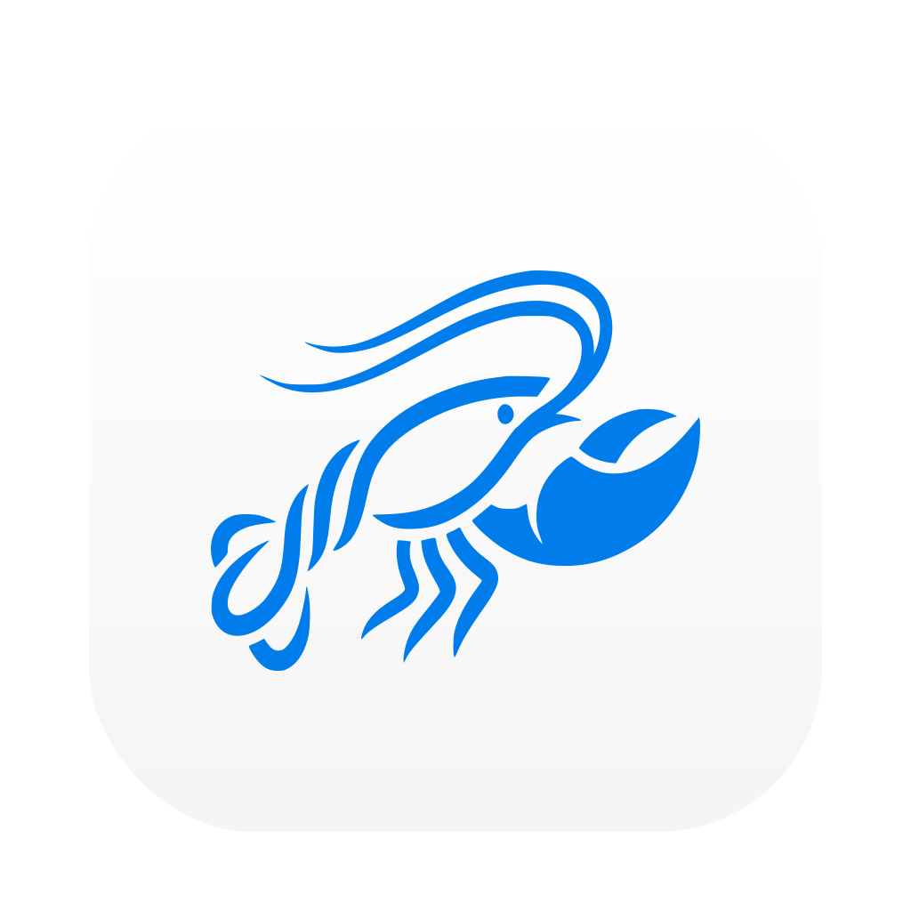

<p align="center">
  
</p>

<h1 align="center">Oclaw</h1>

<p align="center">
  <strong>Enhanced Desktop Interface for OpenClaw AI Agents</strong>
</p>

<p align="center">
  <a href="#features">Features</a> •
  <a href="#getting-started">Getting Started</a> •
  <a href="#whats-different">What's Different</a> •
  <a href="#development">Development</a>
</p>

<p align="center">
  
  
  
  
</p>

<p align="center">
  English | <a href="README.zh-CN.md">简体中文</a>
</p>

---

## Overview

**Oclaw** is a desktop application for OpenClaw AI agents, based on [ClawX](https://github.com/ValueCell-ai/ClawX) with enhanced features and optimizations.

> **Note**: This project is built upon ClawX, the official desktop interface for OpenClaw. We maintain compatibility with upstream while adding unique features tailored for specific use cases.

---

## What's Different from ClawX

Oclaw extends ClawX with the following enhancements:

### 🎨 **Refined Visual Design**
- Rounded corner icons for a modern, polished look
- Optimized macOS app icon sizing for better system integration
- Enhanced UI consistency across all platforms

### 🛠️ **Dual CLI System**
Two independent command-line interfaces for different purposes:

**`oclaw`** - Application Control CLI
```bash
oclaw status              # Check app status
oclaw provider list       # Manage AI providers
oclaw gateway start       # Control gateway
oclaw skill status        # View skill status
```

**`openclaw`** - OpenClaw Platform CLI
```bash
openclaw gateway start    # Start gateway service
openclaw channels login   # Configure channels
openclaw agent --message  # Interact with agents
```

### 🔧 **Enhanced Developer Experience**
- Improved build scripts and automation
- Better error handling and logging
- Streamlined development workflow

### 🌐 **Localization Improvements**
- Enhanced Chinese language support
- Better multi-language configuration handling

---

## Features

All features from ClawX, plus:

### ✨ Unique to Oclaw

- **Dual CLI Interface**: Separate commands for app control and OpenClaw platform operations
- **Refined Icons**: Modern rounded-corner design across all platforms
- **Enhanced Branding**: Consistent Oclaw branding throughout the application
- **Optimized Build**: Improved packaging and distribution process

### 🎯 Inherited from ClawX

- Zero-configuration setup wizard
- Intelligent chat interface with AI agents
- Multi-channel management (Telegram, Discord, WhatsApp, etc.)
- Cron-based task automation
- Extensible skill system with marketplace
- Secure provider integration with system keychain
- Adaptive theming (light/dark mode)

---

## Getting Started

### System Requirements

- **Operating System**: macOS 11+, Windows 10+, or Linux (Ubuntu 20.04+)
- **Memory**: 4GB RAM minimum (8GB recommended)
- **Storage**: 1GB available disk space

### Installation

#### Pre-built Releases (Recommended)

Download the latest release for your platform from the [Releases](https://github.com/wang48/oclaw/releases) page.

#### Build from Source

```bash
# Clone the repository
git clone https://github.com/wang48/oclaw.git
cd oclaw

# Initialize the project (installs dependencies and downloads uv binary)
pnpm run init

# Start in development mode
pnpm dev
```

### First Launch

The **Setup Wizard** will guide you through:

1. **Language & Region** – Configure your preferred locale
2. **AI Provider** – Enter your API keys (OpenAI, Anthropic, etc.)
3. **Skill Bundles** – Select pre-configured skills
4. **Verification** – Test your configuration

### Proxy Settings

ClawX includes built-in proxy settings for environments where Electron, the OpenClaw Gateway, or channels such as Telegram need to reach the internet through a local proxy client.

Open **Settings → Gateway → Proxy** and configure:

- **Proxy Server**: the default proxy for all requests
- **Bypass Rules**: hosts that should connect directly, separated by semicolons, commas, or new lines
- In **Developer Mode**, you can optionally override:
  - **HTTP Proxy**
  - **HTTPS Proxy**
  - **ALL_PROXY / SOCKS**

Recommended local examples:

```text
Proxy Server: http://127.0.0.1:7890
```

Notes:

- A bare `host:port` value is treated as HTTP.
- If advanced proxy fields are left empty, ClawX falls back to `Proxy Server`.
- Saving proxy settings reapplies Electron networking immediately and restarts the Gateway automatically.
- ClawX also syncs the proxy to OpenClaw's Telegram channel config when Telegram is enabled.

---

## CLI Usage

After installation, you have access to two CLI commands:

### Application Control (`oclaw`)

Control the Oclaw desktop application:

```bash
# View help
oclaw --help

# Check application status
oclaw status

# Ollama-style server control
oclaw server
oclaw ps
oclaw logs --lines 50
oclaw stop

# Manage AI providers
oclaw provider list
oclaw provider save '{"id":"my-openai","name":"OpenAI","type":"openai"}' --api-key sk-xxx

# Compatibility commands (still supported)
oclaw gateway status
oclaw gateway start
oclaw gateway stop

# Manage skills
oclaw skill status
oclaw skill enable web-search

# Manage cron jobs
oclaw cron list
oclaw cron trigger <job-id>
```

### OpenClaw Platform (`openclaw`)

Access the full OpenClaw CLI:

```bash
# Gateway operations
openclaw gateway --port 18789

# Channel management
openclaw channels login
openclaw message send --target +1234567890 --message "Hello"

# Agent interaction
openclaw agent --to +1234567890 --message "Summarize this" --deliver

# See full documentation
openclaw --help
```

---

## Development

### Prerequisites

- **Node.js**: 22+ (LTS recommended)
- **Package Manager**: pnpm 10+

### Available Commands

```bash
# Development
pnpm run init             # Install dependencies + download uv
pnpm dev                  # Start with hot reload

# Quality
pnpm lint                 # Run ESLint with auto-fix
pnpm typecheck            # TypeScript validation

# Testing
pnpm test                 # Run unit tests

# Build & Package
pnpm run build:vite       # Build frontend only
pnpm build                # Full production build (with packaging assets)
pnpm package              # Package for current platform
pnpm package:mac          # Package for macOS
pnpm package:win          # Package for Windows
pnpm package:linux        # Package for Linux
```

### Tech Stack

| Layer | Technology |
|-------|------------|
| Runtime | Electron 40+ |
| UI Framework | React 19 + TypeScript |
| Styling | Tailwind CSS + shadcn/ui |
| State | Zustand |
| Build | Vite + electron-builder |
| Testing | Vitest + Playwright |

---

## Architecture

Oclaw uses a **dual-process architecture**:

```
┌─────────────────────────────────────┐
│   Electron Main Process             │
│   - Window & lifecycle management   │
│   - Gateway process supervision     │
│   - IPC handlers                    │
│   - CLI mode detection              │
└──────────────┬──────────────────────┘
               │ IPC
               ▼
┌─────────────────────────────────────┐
│   React Renderer Process            │
│   - UI components (React 19)        │
│   - State management (Zustand)      │
│   - WebSocket client                │
└──────────────┬──────────────────────┘
               │ WebSocket (JSON-RPC)
               ▼
┌─────────────────────────────────────┐
│   OpenClaw Gateway (Child Process)  │
│   - AI agent runtime                │
│   - Channel management              │
│   - Skill execution                 │
└─────────────────────────────────────┘
```

---

## Relationship with ClawX

Oclaw is a **fork** of ClawX with the following relationship:

- **Upstream**: [ClawX](https://github.com/ValueCell-ai/ClawX) - Official OpenClaw desktop interface
- **Downstream**: Oclaw - Enhanced version with additional features

We periodically merge upstream changes from ClawX to stay current with the latest OpenClaw features and improvements.

### When to Use Oclaw vs ClawX

**Use Oclaw if you want:**
- Dual CLI system for both app control and OpenClaw operations
- Refined visual design with rounded icons
- Enhanced Chinese localization
- Specific customizations and optimizations

**Use ClawX if you want:**
- Official release from the OpenClaw team
- Standard feature set without modifications
- Direct upstream support

---

## Contributing

We welcome contributions! Please follow these steps:

1. Fork the repository
2. Create a feature branch (`git checkout -b feature/amazing-feature`)
3. Commit your changes with clear messages
4. Push to your branch
5. Open a Pull Request

### Guidelines

- Follow the existing code style (ESLint + Prettier)
- Write tests for new functionality
- Update documentation as needed
- Keep commits atomic and descriptive

---

## Acknowledgments

Oclaw is built upon:

- [ClawX](https://github.com/ValueCell-ai/ClawX) – The upstream project
- [OpenClaw](https://github.com/OpenClaw) – The AI agent runtime
- [Electron](https://www.electronjs.org/) – Cross-platform desktop framework
- [React](https://react.dev/) – UI component library
- [shadcn/ui](https://ui.shadcn.com/) – Component library

---

## License

Oclaw is released under the [MIT License](LICENSE).

---

<p align="center">
  <sub>Based on ClawX • Enhanced for specific use cases</sub>
</p>
